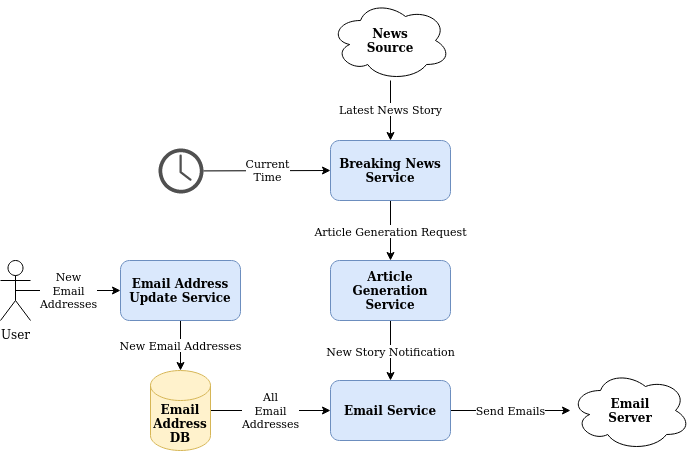
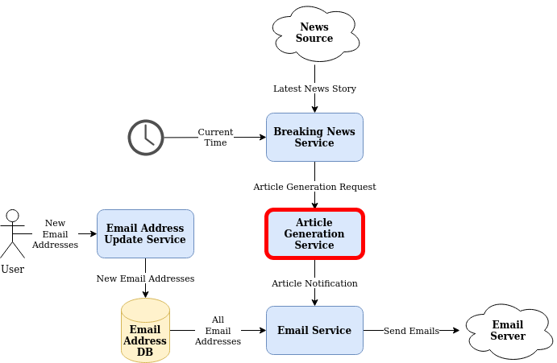
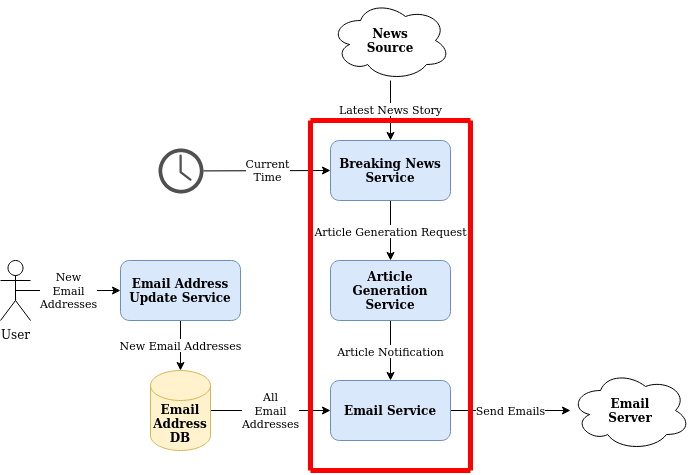
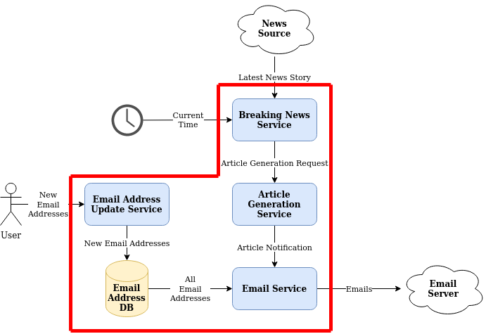

Defining Tests Is Simple, Don't Overthink It
================================================
Let's consider a system with a relatively straightforward objective: to fetch the latest news stories periodically from some external news source, generate a new article for this story, and email it out to a list of addresses.

This architecture is a high-level conceptual architecture rather than a concrete implementation. It may refer to a single application, or it may refer to a set of multiple independant applications. The point is, for the purposes of this exercise, it doesn't matter. Each box is simply some atomic "thing" that has something(s) going into it and/or something(s) going out of it.

# Define Your "System Under Test"
Before you can begin testing something you have built (Or, if you're following Test-Driven-Development, something you *will* build), you need to understand exactly what that "something" is. It may seem obvious, but it is far too easy to accidentally forget the scope of your test the longer you spend writing it.

In any deterministic system, given the same set of inputs, the same output should always be achieved. The thing you are building will be the link between these inputs and outputs. This link we refer to as the "System Under Test".

# Incrementally Widen Your System Under Test

## Unit Testing

A System Under Test should be treated as an atomic unit i.e. for the purposes of testing, we should not care what is inside it or how it achieves its task. All we care about is what goes into it and what comes out of it. The simplest System Under Test for our example would be a single module, let's say the "Article Generation Service", we can visualise this with a red bounary.

This clearly shows the following parameters for our test:

**System Under Test**
* Article Generation Service

**Inputs**
* Article Generation Request

**Outputs**
* Article Notification

Our job is now to create a test with an instance of the Article Generation Service, pass lots of different Article Generation Requests to it, and verify that the expected Article Notifications are output as a result.

## Integration Testing
Unit testing is often quite intuitive. However, as the test boundary increases and our System Under Test becomes bigger, it can become more challenging. Luckily, the same principles already discussed remain. We may want to test the following business requirement:

>At 11am, the latest news articles are emailed out to our users

Notice how the requirement makes no mention of the internal services. For the most part, neither should your test as these details would lie within the test boundary and therefore, as we treat out System Under Test as atomic, we pretend like we don't know about them.

Visualising a well-defined boundary before beginning the test makes the inputs and outputs clearly apparent - it is anything that crosses the boundary.

**System Under Test**
* Services involved with generating news articles and emailing them out to users

**Inputs**
* Current Time
* Latest News Story
* All Email Addresses

**Outputs**
* Emails

Again, defining individual test cases is no different to before: we generate various combinations of inputs and verify that the output variable is as we would expect in that scenario.

Time is the input that I most frequently see overlooked in testing. If an application is in any way time dependent, then the System Under Test should be tested against various times and it should receive the time via the same mechanism as it would in the real system. All too often I see tests where the time has been forced into the middle of the System Under Test by some inorganic means or the time component has been skipped entirely and the internals of the System Under Test have been invoked directly. This breaks the entire concept of the test boundary - in the best case scenario it means that test coverage is reduced, in the worst case scenario it means that the tests are completely invalid.

## End-to-End Testing
Testing an entire system, once again, is no different conceptually to testing subcomponents of that system. We define our System Under Test as being everything that is under out control and define the inputs and outputs as anything interacting directly with the boundary we draw that separates our stuff from external stuff.

**System Under Test**
* The entire system under our control

**Inputs**
* Current Time
* Latest News Story
* New Email Addresses

**Outputs**
* Emails

In this, our broadest of our systems under test, we are no longer providing an approved list of email addresses on behalf of the database. Instead, the database is inside the test boundary so we don't need to know or care that it even exists. It will get its data as it would in real-life: by user/service interaction.

Another mistake I often seen made once databases are included inside the test scope is probing the database itself for its state as a final test assertion. A database is simply a tool used to facilitate a business objective, setting the state of a database is, in most cases, not the business objective itself. Therefore, as in this example the database lives completely inside the test boundary and we consider everything inside this boundary to be atomic, the test should not have any reference to the database at all. Doing so not only undermines the responsibilities of the different levels of testing, but also makes the tests needlessly complex. Additionally, maintainability of the system is compromised as it is no longer possible to wholly replace a system under test with a new implementation as implementation details will have been leaked into the test code.

# Conclusion
We have discussed the concept of "System Under Test" and how to define your test boundary. Before beginning to write any test these should be known so that any interaction which crosses this boundary can be considered the inputs and outputs to the system. In a deterministic system, any unique combination of inputs should result exactly the same combination of outputs every time.

In most circumstances, nothing beyond these three variables should be referenced in a test else we risk introducing needless complexity, fragility, and unmaintainability of the codebase.
